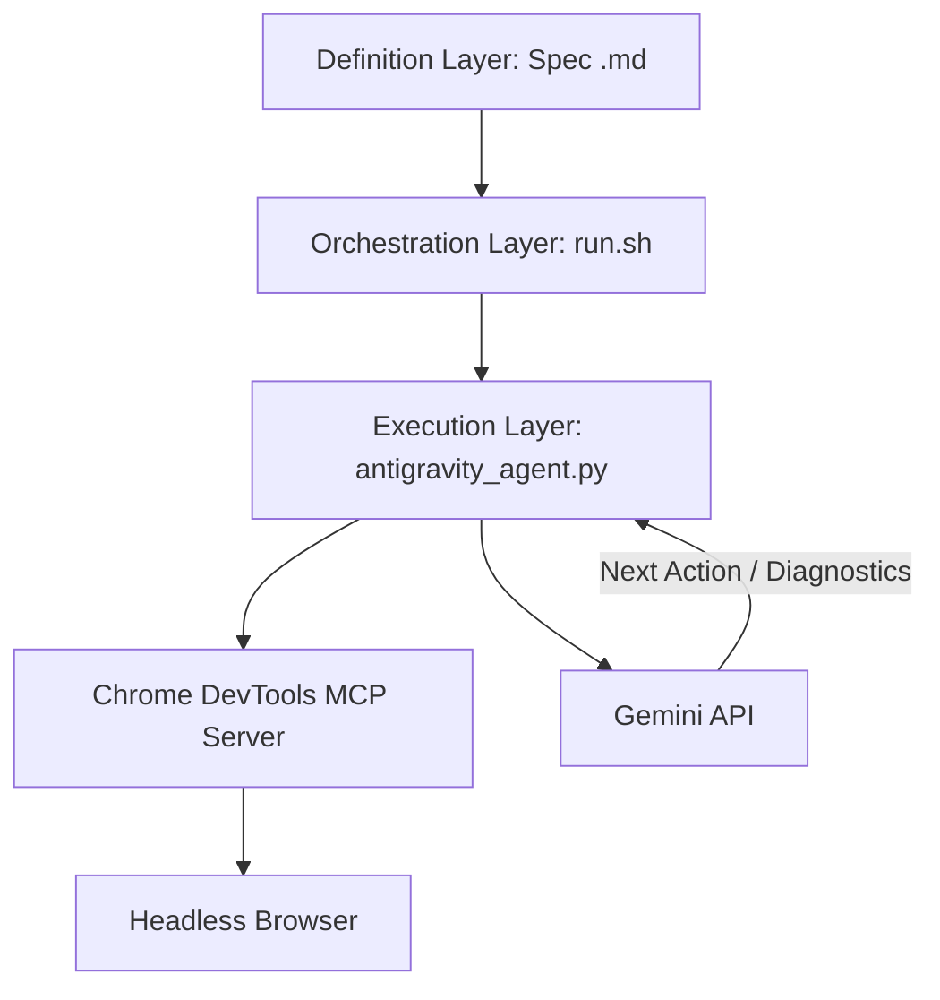

# web-flow-agent

Instead of requiring the developer to interact in real-time ("on-demand"), this system allows you to schedule and automate autonomous QA flows written in human-readable Markdown files. It interacts with the interface using the **Chrome DevTools MCP (Model Context Protocol)** and semantically analyzes each step using the Gemini API.

---

## 1. System Architecture

The system consists of three decoupled layers that interact with each other:



Project file structure:

```
/Users/LuisPerez/Documents/web-flow-agent
├── .agents/
│   ├── mcp_config.json       # Local MCP server configuration
│   └── chrome-profile/       # Isolated Chrome profile to prevent session locks
├── flows/
│   └── example_flow.md       # QA flow specification
├── reports/                  # Directory containing execution reports
├── antigravity_agent.py      # Main agent script (CLI)
└── run.sh                    # Orchestrator script
```

1. **Definition Layer (Specs)**: `.md` files in the `flows/` folder that describe the business goal and step-by-step actions in structured natural language.
2. **Orchestration Layer (`run.sh`)**: Bash script that iterates over the defined flows, configures global environment variables, and invokes the autonomous agent.
3. **Execution Layer (`antigravity_agent.py`)**: Python headless engine that controls the browser via JSON-RPC over Stdio using the Chrome DevTools MCP server (configured in `.agents/mcp_config.json`), queries Gemini for decision-making, and generates post-mortem diagnostics.

---

## 2. Prerequisites

To run this PoC, ensure you have the following installed on your system:
- **Python 3**: Used to run the agent script (`antigravity_agent.py`).
- **Node.js (with npx)**: Required to start the Chrome DevTools MCP server in the background automatically.
- **Chrome / Chromium**: The MCP server will start and control a local Chrome instance.

---

## 3. Step-by-Step Guide: How It Works

When you run the test suite, the following workflow is executed autonomously step-by-step:

### Step 1: Environment Initialization
The orchestrator `run.sh` validates that the `GEMINI_API_KEY` variable is set and identifies the target URL to test (which must be passed as a parameter using `--url`).

### Step 2: Reading the Spec
The agent (`antigravity_agent.py`) reads the Markdown flow file (e.g., `flows/example_flow.md`) and parses the main **Objective** and the sequential **Actions**.

### Step 3: Browser Initialization and MCP Integration
The agent starts the `chrome-devtools-mcp` server in a subprocess by running `npx -y chrome-devtools-mcp` isolated in the `.agents/chrome-profile` folder to avoid conflicts with other sessions. It connects using the MCP protocol (JSON-RPC over Stdio) and ensures that at least one active browser tab is open.

### Step 4: Autonomous Navigation Loop
In each turn of the loop:
1. **State Extraction**: The current page URL is retrieved and an accessibility snapshot (A11y tree) of the DOM is generated using the MCP's `take_snapshot` tool. This provides a structured tree of elements with unique UIDs (e.g., `[12] button "Add to cart"`).
2. **Log Retrieval**: The latest console logs and network requests are retrieved.
3. **Intelligent Decision (Gemini)**: All this information, along with the objective and the history of previous steps, is sent to the Gemini API.
4. **Action Execution**: Gemini responds with a JSON object specifying the MCP tool to execute (e.g., `navigate_page` to a relative path resolved against your base URL, `click` on a UID, or `fill` a value in an input element) and executes it in the browser.

### Step 5: Completion and Post-Mortem Diagnostics
- **If the flow succeeds**: The agent detects that the objective was met, reports success, and exits with exit code `0`.
- **If the flow fails** (or if a bug/error is encountered on your site):
  1. The loop is stopped, and the status is set to `fail` or `error`.
  2. A final screenshot of the UI is captured (`take_screenshot`).
  3. A dump of the last DOM state is saved.
  4. Network requests (including 4xx and 500 errors) and console exceptions are compiled.
  5. A specific execution folder is created at `reports/report_<flow>_<audited_url>_<date>_<time>/` and the detailed report (`report.md` / `report.json`), screenshot (`screenshot.png`), DOM snapshot, and error log (if any) are written there.

---

## 4. Usage Instructions

### 1. Configure the Gemini API Key
You can configure the key in two ways:
- **`.env` File (Recommended)**: Copy the template `.env.example` file to `.env` and enter your key:
  ```bash
  cp .env.example .env
  # Then edit the .env file and add your GEMINI_API_KEY
  ```
- **Export in the terminal**:
  ```bash
  export GEMINI_API_KEY="your-gemini-api-key"
  ```

### 2. Create a Spec (QA Flow)
Create a Markdown file inside the `flows/` folder (for example, `flows/my_checkout_flow.md`). The format must follow this basic structure:
```markdown
# Scenario: Search and Cart Flow Validation
- **Objective:** Search for an item, add it to the cart, and proceed to checkout.
- **Action:** Visit /products
- **Action:** Search for "SKU-123" in the search bar
- **Action:** Click "Add to Cart"
- **Action:** Click "Proceed to Checkout"
```
*Note: Paths for `Visit` must be relative (starting with `/`) so the agent can resolve them dynamically depending on the environment.*

### 3. Run the Tests

To run the tests, use the `run.sh` script, passing the mandatory `--url` parameter for the environment you want to test:

```bash
./run.sh --url http://localhost:3000
```

#### Interactive Selection Menu (Default)
When you run the command, an interactive menu will display in the terminal listing all available flow files in the `flows/` folder:
```
==================================================
Select the QA flow you want to run:
0) [Run all flows]
1) example_flow_1.md
2) example_flow_2.md
3) example_flow_3.md
==================================================
Choose an option (0-3) [0]: 
```

#### Direct Selection (Non-interactive)
If you want to run a specific flow directly (for example, for automation or CI/CD integration), you can pass the optional `--flow` parameter:
```bash
./run.sh --url https://www.lperezp.dev --flow example_flow_1.md
```

---

## 5. QA Outputs and Reports

Inside the execution report folder you will find:
- `report.md`: A readable, detailed Markdown report summarizing the entire execution step-by-step (incorporating thoughts, actions, results, and screenshots for each turn).
- `report.json`: A structured report containing step history, agent thoughts, and console/network logs.
- `step_[turn]_[action].png`: Individual screenshots generated automatically after executing each step.
- `screenshot.png`: Web interface screenshot at the final state (or when the failure occurred).
- `snapshot.txt`: Hierarchical accessible DOM structure in text format at the end of the test.
- `error.log` (Only in case of exceptions): Detailed Python error stack trace for in-depth diagnosis.

MCP server startup logs are generally saved in `reports/mcp_server_stderr.log`.
