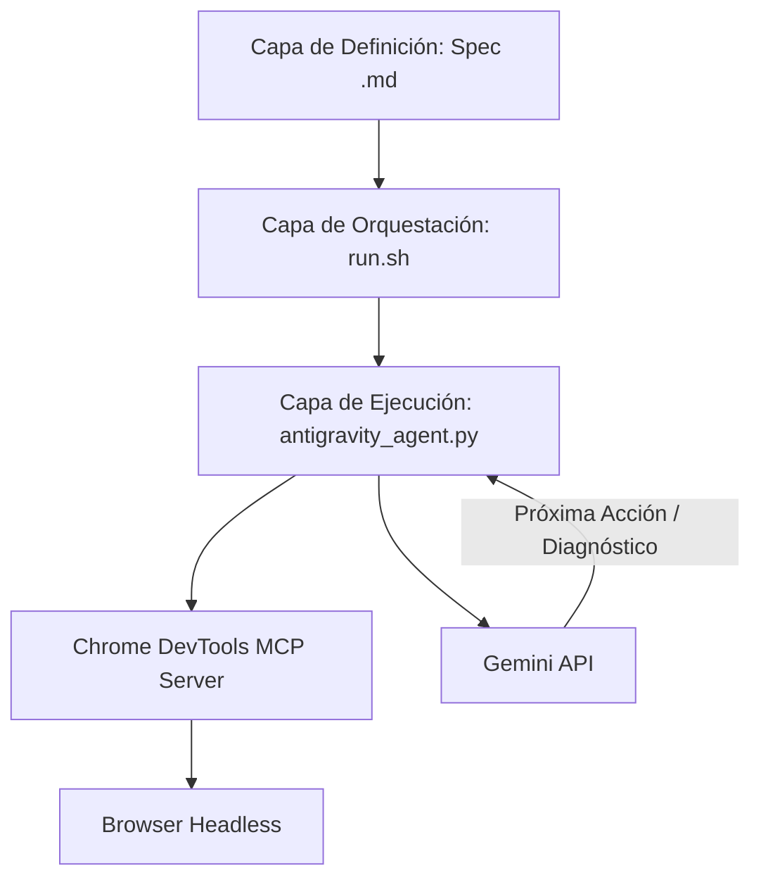

# Antigravity 2.0 – QA Autonomous Sidecar (PoC)

Este repositorio contiene un Proof of Concept (PoC) de **Antigravity 2.0**, transformando al agente en una plataforma de **Headless Background Labor**. 

En lugar de requerir que el desarrollador interactúe en tiempo real ("on-demand"), este sistema permite programar y automatizar flujos de QA autónomos escritos en archivos de Markdown legibles, interactuando con la interfaz mediante el protocolo **MCP (Model Context Protocol) de Chrome DevTools** y analizando semánticamente cada paso utilizando la API de Gemini.

---

## 1. Arquitectura del Sistema

El sistema consta de tres capas desacopladas que interactúan entre sí:



Estructura de archivos del proyecto:

```
/Users/LuisPerez/Documents/ghost-agent
├── .agents/
│   ├── mcp_config.json       # Configuración local del servidor MCP
│   └── chrome-profile/       # Perfil aislado de Chrome para evitar bloqueos
├── flows/
│   └── ejemplo_flujo.md      # Especificación del flujo de QA
├── reports/                  # Carpeta contenedora de reportes de ejecución
├── antigravity_agent.py      # Script principal del agente (CLI)
└── run.sh                    # Script orquestador
```

1. **Capa de Definición (Specs)**: Archivos `.md` en la carpeta `flows/` que describen el objetivo de negocio y los pasos en lenguaje natural estructurado.
2. **Capa de Orquestación (`run.sh`)**: Script en Bash que itera sobre los flujos definidos, configura las variables globales de entorno y llama al agente autónomo.
3. **Capa de Ejecución (`antigravity_agent.py`)**: Motor headless en Python que controla el navegador mediante JSON-RPC sobre Stdio con el servidor de Chrome DevTools MCP (configurado en `.agents/mcp_config.json`), consulta a Gemini para tomar decisiones y genera diagnósticos post-mortem.

---

## 2. Requisitos Previos

Para ejecutar este PoC, asegúrate de tener instalado en tu sistema:
- **Python 3**: Utilizado para ejecutar el script del agente (`antigravity_agent.py`).
- **Node.js (con npx)**: Requerido para iniciar el servidor de Chrome DevTools MCP en segundo plano de manera automática.
- **Chrome / Chromium**: El servidor MCP iniciará y controlará una instancia local de Chrome.

---

## 3. Guía Paso a Paso: Cómo Funciona

Cuando ejecutas la suite de pruebas, se realiza el siguiente flujo paso a paso de forma autónoma:

### Paso 1: Inicialización del Entorno
El orquestador `run.sh` valida que tengas configurada la variable `GEMINI_API_KEY` e identifica qué URL deseas probar (la cual se pasa obligatoriamente como parámetro mediante `--url`).

### Paso 2: Lectura del Spec
El agente (`antigravity_agent.py`) lee el archivo Markdown del flujo (ej. `flows/ejemplo_flujo.md`) y parsea el **Objetivo** principal y las **Acciones** secuenciales.

### Paso 3: Inicialización del Browser e Integración MCP
El agente inicia el servidor `chrome-devtools-mcp` mediante un subproceso ejecutando `npx -y chrome-devtools-mcp` aislado en la carpeta `.agents/chrome-profile` para evitar bloqueos con otras sesiones. Se conecta mediante el protocolo MCP (JSON-RPC sobre Stdio) y asegura que exista al menos una pestaña de navegación activa.

### Paso 4: Bucle de Navegación Autónoma (Hasta 15 turnos)
En cada turno del bucle:
1. **Extracción de Estado**: Se captura la URL actual de la página y se genera un snapshot de accesibilidad (A11y tree) del DOM usando la herramienta `take_snapshot` del MCP. Esto proporciona un árbol estructurado de elementos con UIDs únicos (ej. `[12] button "Añadir al carrito"`).
2. **Obtención de Logs**: Se extraen los últimos mensajes de consola y peticiones de red.
3. **Decisión Inteligente (Gemini)**: Se envía toda esta información junto con el objetivo y el historial de pasos previos a la API de Gemini. 
4. **Ejecución de Acción**: Gemini responde en formato JSON indicando la herramienta MCP a ejecutar (ej. `navigate_page` a una ruta resuelta contra tu URL base, hacer `click` en un UID, o escribir (`fill`) un valor en un input) y la ejecuta en el navegador.

### Paso 5: Finalización y Diagnóstico Post-Mortem
- **Si el flujo tiene éxito**: El agente detecta que se cumplió el objetivo, reporta el éxito y finaliza con código de salida `0`.
- **Si el flujo falla** (o si ocurre un error/bug en tu web):
  1. Se detiene el bucle y se establece el estado en `fail` o `error`.
  2. Se toma una captura de pantalla final de la UI (`take_screenshot`).
  3. Se guarda un volcado del último estado del DOM.
  4. Se compilan las llamadas de red (incluyendo errores 4xx y 500) y excepciones de consola.
  5. Crea una carpeta específica para la ejecución en `reports/report_<flujo>_<url_auditada>_<date>_<time>/` y escribe allí el reporte detallado (`report.json`), la captura de pantalla (`screenshot.png`), el snapshot del DOM y el log de errores si los hubo.

---

## 4. Instrucciones de Uso

### 1. Configurar la API Key de Gemini
Puedes configurar la clave de dos maneras:
- **Archivo `.env` (Recomendado)**: Copia el archivo de plantilla `.env.example` como `.env` e introduce tu clave:
  ```bash
  cp .env.example .env
  # Luego edita el archivo .env e introduce tu GEMINI_API_KEY
  ```
- **Exportar en la terminal**:
  ```bash
  export GEMINI_API_KEY="tu-api-key-de-gemini"
  ```

### 2. Crear un Spec (Flujo de QA)
Crea un archivo Markdown dentro de la carpeta `flows/` (por ejemplo, `flows/mi_flujo_compra.md`). El formato debe seguir esta estructura básica:
```markdown
# Escenario: Validación de Flujo de Búsqueda y Carrito
- **Objetivo:** Buscar un artículo, añadirlo al carrito y avanzar al checkout.
- **Acción:** Visitar /productos
- **Acción:** Buscar por "SKU-123" en el buscador
- **Acción:** Hacer clic en "Añadir al Carrito"
- **Acción:** Hacer clic en "Proceder al Checkout"
```
*Nota: Las rutas de `Visitar` deben ser relativas (empezando con `/`) para que el agente pueda resolverlas dinámicamente según el entorno.*

### 3. Ejecutar las Pruebas

Para ejecutar las pruebas, utiliza el script `run.sh` pasando el parámetro obligatorio `--url` del entorno que deseas probar:

```bash
./run.sh --url http://localhost:3000
```

#### Menú Selector Interactivo (Por Defecto)
Al ejecutar el comando, se desplegará un menú interactivo en la terminal listando todos los archivos de flujo disponibles en la carpeta `flows/`:
```
==================================================
Selecciona el flujo de QA que deseas ejecutar:
0) [Ejecutar todos los flujos]
1) ejemplo_flujo.md
2) tag_cuero_visualizacion.md
3) tag_cuero_no_conflicto.md
==================================================
Elige una opción (0-3) [0]: 
```

#### Selección Directa (No interactiva)
Si deseas ejecutar un flujo específico de forma directa (por ejemplo, para automatizar o integrarlo en CI/CD), puedes pasar el parámetro opcional `--flow`:
```bash
./run.sh --url https://www.oechsle.pe --flow tag_cuero_visualizacion.md
```

---

## 5. Salidas y Reportes de QA

Para mantener el historial ordenado y evitar sobreescribir ejecuciones anteriores, cada corrida genera una carpeta única dentro de `./reports` con el formato `reports/report_[flujo]_[url_auditada]_[date]_[time]/`:

Dentro de esa carpeta encontrarás:
- `report.md`: Reporte legible y detallado en formato Markdown que resume toda la ejecución paso a paso (pensamientos, acciones y resultados por turno).
- `report.json`: Reporte estructurado con el historial de pasos, pensamientos del agente y logs de consola/red.
- `screenshot.png`: Captura de pantalla de la interfaz web en el momento final (o al ocurrir el fallo).
- `snapshot.txt`: Estructura jerárquica del DOM accesible en formato texto al finalizar la prueba.
- `error.log` (Solo en caso de excepción): Traza detallada de la pila de errores de Python para diagnóstico en profundidad.

Los logs de arranque del servidor MCP se guardan de forma general en `reports/mcp_server_stderr.log`.
